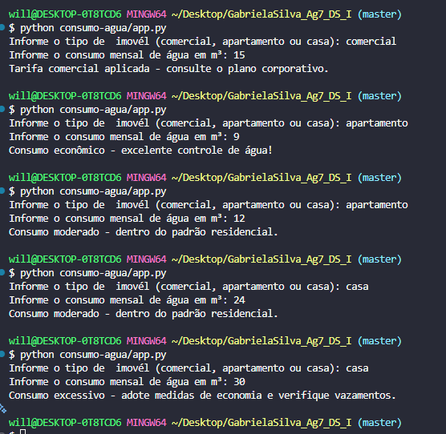

#💧CONTROLE DE CONSUMO DE ÁGUA

##🎯 Sobre o projeto

Programa em Python desenvolvido para uma campanha de conscientização ambiental de uma companhia de saneamento. O sistema classifica o perfil de consumo de água de um imóvel (comercial, casa ou apartamento) e emite um alerta educativo para incentivar o uso consciente da água. 🌱

##⚙️ Como funciona

1- O programa solicita o tipo de imóvel: comercial, casa ou apartamento.
2- Em seguida, solicita o consumo mensal de água em m³ (aceita números decimais).
3- Com base nesses dados, aplica as seguintes regras de negócio:
	
Tipo = comercial	🏢 "Tarifa comercial aplicada – consulte o plano corporativo."
Tipo = apartamento e consumo < 10 m³	💧 "Consumo econômico – excelente controle de água!"
Tipo = apartamento ou casa e consumo ≤ 25 m³	✅ "Consumo moderado – dentro do padrão residencial."
Qualquer outro caso (acima do limite residencial)	🚨 "Consumo excessivo – adote medidas de economia e verifique vazamentos."

##🛠️ Tecnologia utilizada

🐍 Python

##▶️ Como executar

Pré-requisitos
Ter o Python  instalado na máquina.

# 1. Clone este repositório
git clone https://github.com/gabsb403/consumo-agua.git

# 2. Acesse a pasta do projeto
cd consumo-agua

# 3. Execute o programa
python app.py

##▶️ Exemplos de execução

